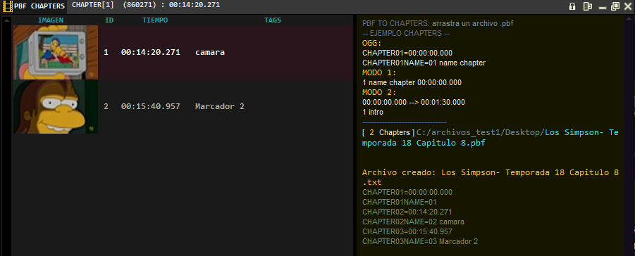

# Potplayer .pbf to chapters
programa realizado con python y tkinter para visualizar los capitulos o chapters de un video que genera potplayer (un archivo `.pbf`) y convertirlo a un formato tipo OGG u otro (en progreso) 



* arrastra el archivo `.pbf` sobre el programa para que muestre informacion de todos los chapters
* al seleccionar un item: muestra en la barra del titulo el numero de chapter, el tiempo en milisegundos y el tiempo en timestamp


---

## notes

para colocar el scrollbar hay mas control con pack  que con place (ademas que cuando usaba place el scroll se redimensionaba automaticamente a lo ancho, lo que lo deformaba)

la ventana totalmente funcional
el treeview funciona al arrastrar un archivo .pbf este lee toda la info y la muestra correctamente

Los estilos para no haya el margen blanco alrededor de el treeview y del scrollbar que no se pueden quitar o cambiar, se uso el estilo por default (por el momento es el mejor, pero hay que verificar con otros widgets) de momento en este proyecto todos los estilos estan bien

al seleccionar un item muestra info del marcador (por el momento lo deshabilite para implementar lo de la edicion)

+ se cambio la orientacion de widgets a horizontal
+ se cambio el icono del programa
+ el tamaño de la ventana y el panel de marcadores se asigna desde config.html
+ se agrego poder editar el titulo del marcador seleccionadolo y presionando enter (para mejor manejo con las flechas)

## to do

aun por implementar

edicion de los datos del treeview (de manera directa)

json o toml para la plantilla de formatos de salida

ver la salida en otra pestaña

agregar un caja de texto con info del marcador y del programa

agregar menu item de recargar el .pbf (resetear edicion), clear all, clear info, export, info desarrollador

## fix

se debe usar el select no el Button-1 (porque falla en el metodo)

```python
# self.bind("<Button-1>", self.itemClick)
self.bind("<<TreeviewSelect>>", self.itemClick)
```

+ se corrigio el error, cuando se arrastraba otro pbf la seleccion del item anterior no devolvia nada